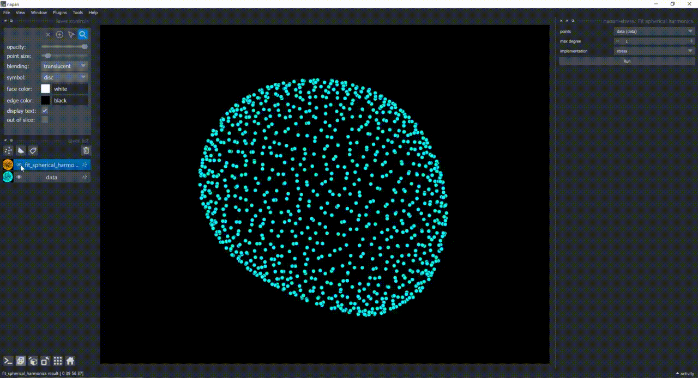
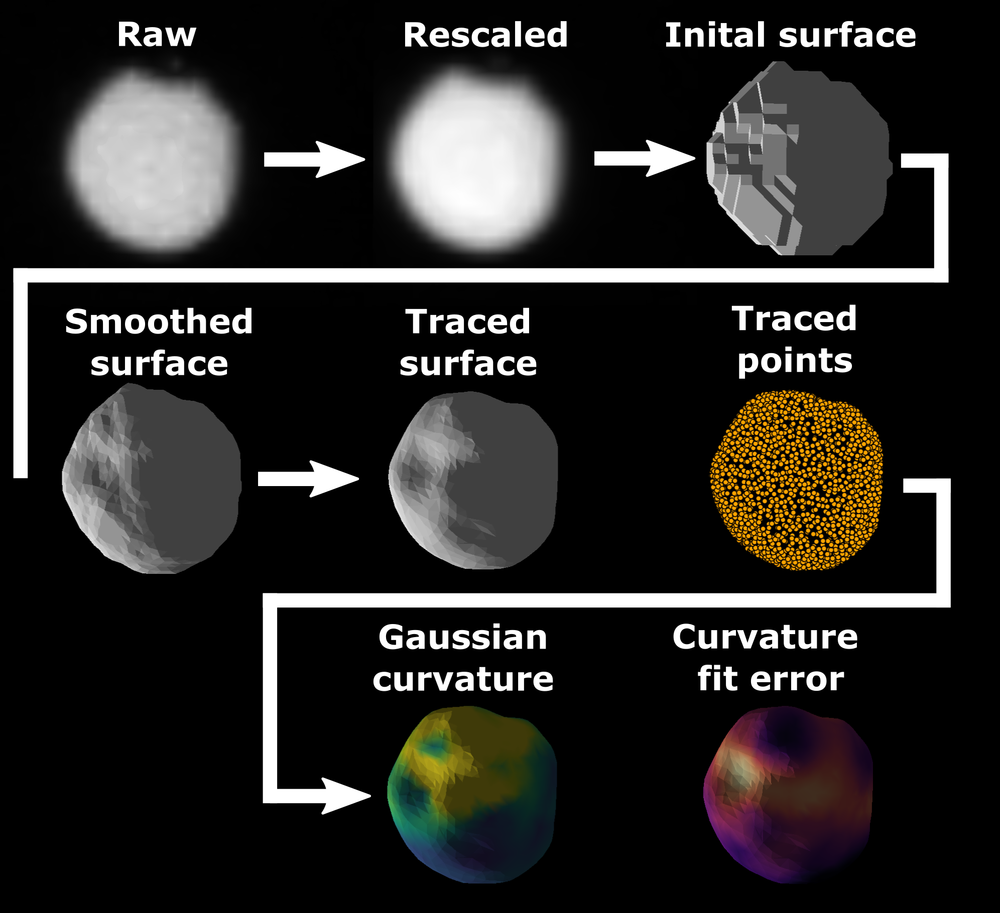

# napari-stress

This plugin provides tools for the analysis of surfaces in Napari, such as utilities to determine and refine the surface-representation of objects using a ray-casting approach and calculate the curvature of surfaces. It re-implements code in Napari that was written for [Gross et al. (2021): STRESS, an automated geometrical characterization of deformable particles for in vivo measurements of cell and tissue mechanical stresses](https://www.biorxiv.org/content/10.1101/2021.03.26.437148v1) and has been made open source in [this repository](https://github.com/campaslab/STRESS).




## Installation

Create a new conda environment with

```
conda create -n napari-stress Python=3.9
conda activate napari-stress
```

Install a few necessary plugins:

```
conda install -c conda-forge napari jupyterlab
```

To install the plugin, clone the repository and install it:

```
git clone https://github.com/BiAPoL/napari-stress.git
cd napari-stress
pip install -e .
```

## Usage

Functionality in this repository is divided in two groups: **Recipes** and **plugins**.

### Recipes

Napari-stress provides jupyter notebooks with [complete workflows](./docs/notebooks/recipes) for different types of input data and objectives. Napari-stress currently provides notebooks for the following data/image types:

* **Confocal data** (*.tif*), 3D+t: This type of data can be processed with napari-stressed as show in [this notebook](./docs/notebooks/recipes/Process_confocal.ipynb)




* **Lightsheet data** (*.czi*), 3D + t: coming soon....

### Plugins

All functions in this repository are documented separately as Jupyter notebooks [here](./docs/notebooks/demo). 


### Utilities

Data to be used for this plugin is typically of the form `[TZYX]` (e.g., 3D + time). Napari-stress offers convenient ways to use functions from other repositories (which are often made for 3D data) on timelapse data with the `frame_by_frame` function and the `TimelapseConverter` class. Both are described in more detail in [this notebook](https://github.com/BiAPoL/napari-stress/blob/main/docs/notebooks/demo/demo_timelapse_processing.ipynb).


## Issues

To report bugs, request new features or get in touch, please [open an issue](https://github.com/BiAPoL/napari-stress/issues) or tag `@EL_Pollo_Diablo` on [image.sc](https://forum.image.sc/).


